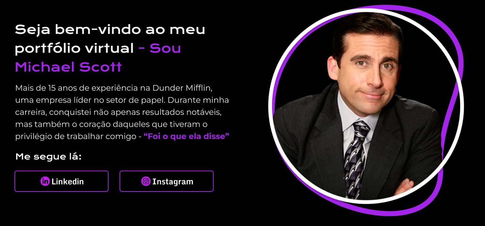
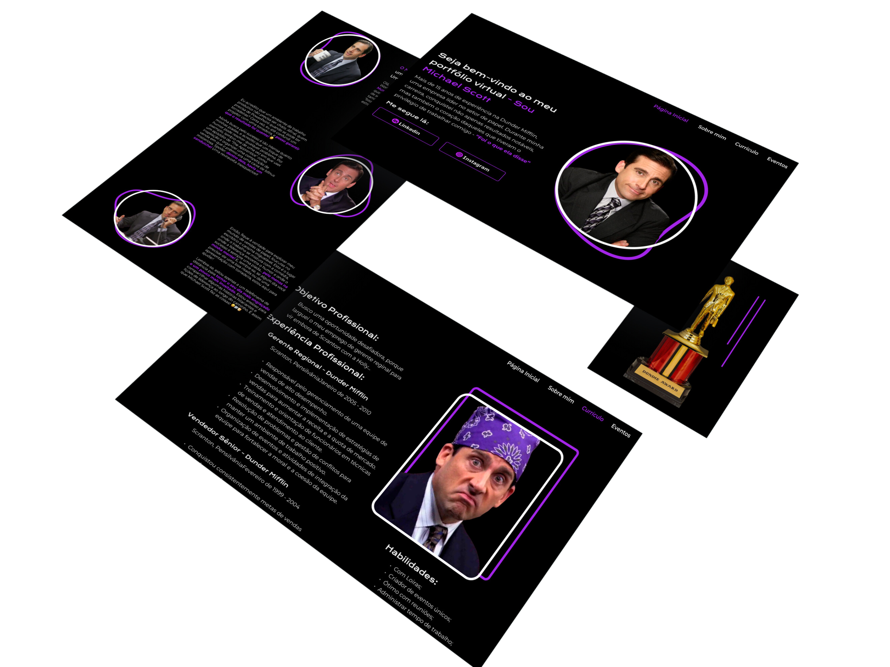

# Meu Portfolio Studway




> Projeto para você começar a impressionar nas vagas de emprego, aprenda montar um portifólio para se apresentar adequadamente aos recrutadores.


## 💼 Principais Ferramentas


## 💻 Pré-requisitos

* Disciplina ⌛
* Força de Vontade 💪
* Visua Studio Code instalado 🖥️

## ☕ Resultado do projeto

Aqui temos uma prévia de como vai ficar o final do projeto que estaremos construindo juntos na nossa [Playlist](https://youtube.com/playlist?list=PLPi2jprGhwsLVSknDc84yL3bDxgj5kkQ2&si=Vl_vOCBCbVejPbwL)



## 🚀 Clonando o repositorio

Para Clonar a base do projeto você pode ver o video abaixo ou seguir o seguinte processo:

Video Youtube:
```
<Link>
```

Copie o comando abaixo e cole no seu terminal para fazer o clone:

```
git clone https://github.com/StudWay/Portfolio_MichaelScott.git
```

OBS: importante se atentar em qual pasta está clonando o projeto para não se perder.

## 🤝 Colaboradores

Para mais conteudos siga-nos:

<table>
    <tr>
        <td align="center">
           <a href = "https://www.youtube.com/@stud-way">
            </br>
            <sub>
                Studway
            </sub>
            </a>
        </td>
    </tr>
</table>